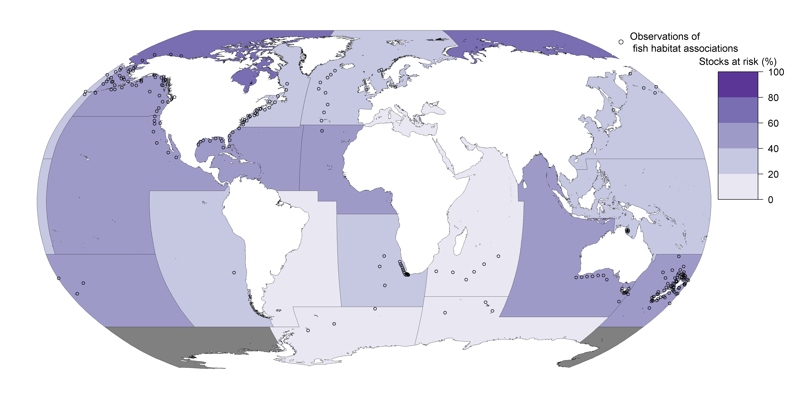

# The fishscape database

By CJ Brown, Andrew Broadley

19 Sept 2018

Provided in support of the submitted paper (currently available as a pre-print):

[The assessment of fishery status depends on fish habitats](https://onlinelibrary.wiley.com/doi/abs/10.1111/faf.12318)
Christopher J Brown, Andrew Broadley, Fernanda Adame, Trevor A Branch, Mischa Turschwell, Rod M Connolly.
Fish and Fisheries https://doi.org/10.1111/faf.12318

If you can't access the paper, [email me](mailto:chris.brown@griffith.edu.au) or [click here an open-access pre-print (which is near identical to the published version)](https://www.biorxiv.org/content/early/2017/12/13/233478).

To cite the database use: Brown and Broadley 2017 Fishscape https://doi.org/10.25904/1912/4017
Or cite the paper above.

Please cite that paper if you use this resource. We would also like to hear how you are using this (to prevent duplicated effort and improve the database into the future): chris.brown@griffith.edu.au

License: [MIT](https://opensource.org/licenses/MIT) + file [LICENSE](/LICENSE)

*Image: Location of stocks included in the fishscape database and FAO regions.*

We are grateful for funding from the Australian Research Council which has helped support this work.

## Description

This is a database of fish associations with their habitats. We (primarily Andrew) reviewed the peer-reviewed and grey literatures for evidence of fish associations with particular habitats.

It is a long-form database, where each row corresponds to one observation of a fish habitat association. A single paper can have multiple rows if for instance it reports on multiple species, or it has measured fish-habitat relationships for a single species in multiple different ways.
"Fish" includes bony and cartilaginous fish and fished invertebrates.

Currently we have focussed on species included in the [RAM Legacy database](http://ramlegacy.org/). We plan to expand the database to all species in the FAO catch series in 2018.

## Files
See the [Github repo](https://github.com/cbrown5/fishscape) to access all files.

[The fishscape database as a csv](/data-raw/fish-hab-db_v1.csv)

[Metadata](meta-data.html)

[A complete bibliography of reviewed papers as a bibtex file](/fish-hab-db-refs.bib)

[R code used to generate figures in the submitted paper](https://github.com/cbrown5/fishscape/tree/master/GlobalFishStatus)

[A csv of RAM Legacy stocks that we cross referenced with our database](/data-raw/priority-fish-stocks.csv)
